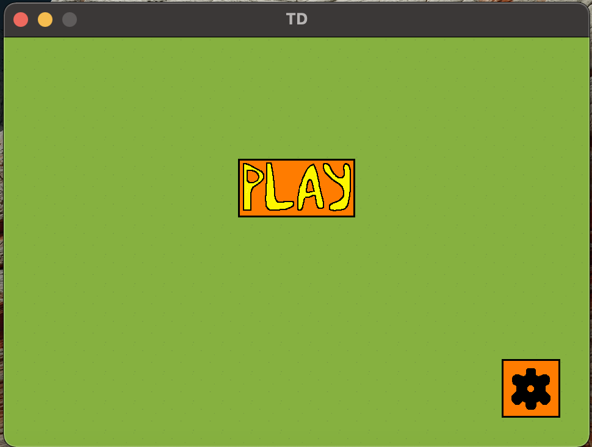
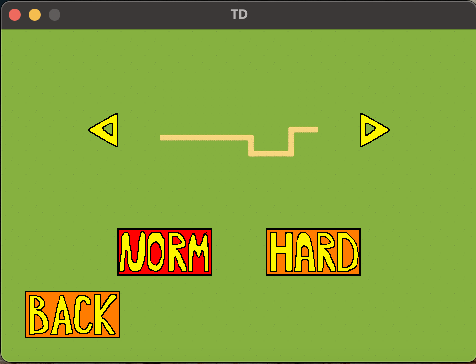
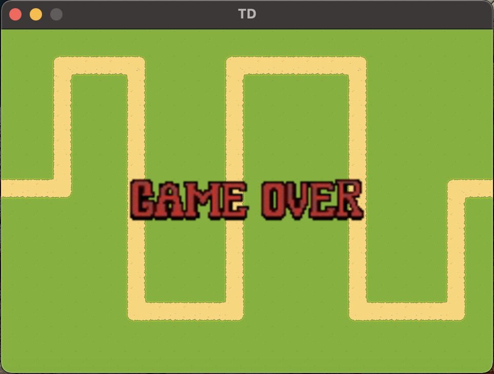

##	Tower Defence

###	**Описание:**

*Перед началом игры пользователь может выбрать сложность. До начала первого раунда игроку доступно некоторое количество золота, на него можно приобрести первую башню. После начала раунда начинают выходить крипы, покупать и ставить башни можно в перерывы между раундами.  Цель игрока продержаться 10 раундов и не давать крипам проходить весь путь.*

### **Типы крипов**

#### 1. Batyr:
- *Less health*
- *High speed*
- *Low armor*
- *High evasion*
#### 2. Sameer:
- *More health*
- *Low speed*
- *High armor*
- *Low evasion*
#### 3. Jegor:
- *Even More health*
- *Lower speed*
- *Higher armor*
- *No evasion*

### **Типы башен**

1. Singletower
2. Multitower
4. Freezingtower
5. Onepunchtower

### **Управление:**

`Q + LMouse` - *Установить Singletower*

`W + LMouse` - *Установить Multitower*

`E + LMouse` - *Установить Freezingtower*

`R + LMouse` - *Установить Onepunchtower*

`X` - *Отмена установки*

`A` - *Ускорение 2х*

`B` - *Пауза*

`D` - *Выход в главное меню*

### **Запуск:**

#### **Linux:**
  
  sudo apt-get install libsfml-dev \
  chmod +x run.sh \
  ./run.sh
  ./LastGame
  
#### **Mac:**
  
  brew install sfml \
  chmod +x run.sh \
  ./run.sh
  ./LastGame

### **Дополнительные условия:**

*1. Графический интерфейс*

*2. Внутриигровой редактор*

### **Изменения 1:**

1. *Singleton test*

### **Изменения 2:**

1. Added Jegor Creep:

2. Внутриигровой редактор:
- Изменение уровня сложности
- Выбор карты
- Ускорение игрового процесса 2х
- Пауза
- Выход в главное меню

3. Сборка под Linux, Mac

### **Паттерны:**
1. Factory: \
Создается общий интерфейс юнитов в файле Unit, от которого наследуются юниты: Creep, Tower.\
Позволяет быстро добавить новую сущность
2. Adapter: \
Ключевые объекты SFML обернуты в Adapter. Позволяет за O(1) поменять библиотеку, \
т. к. кроме файла Adapter, SFML напрямую нигде не используется
3. Singleton: \
В файле Game. Создан для хранения данных игровой сессии

### **Примеры:**

​

​

​

​

​
