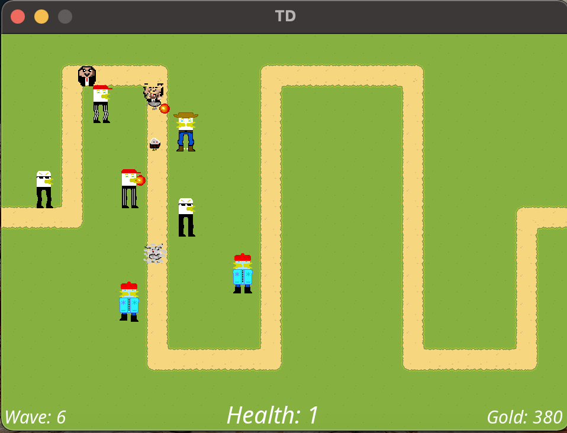

##	Tower Defence

###	**Описание:**

*Перед началом игры пользователь может выбрать сложность. До начала первого раунда игроку доступно некоторое количество золота, на него можно приобрести первую башню. После начала раунда начинают выходить крипы, покупать и ставить башни можно в перерывы между раундами.  Цель игрока продержаться 10 раундов и не давать крипам проходить весь путь.*

### **Типы крипов**

#### 1. Batyr:
- *Less health*
- *High speed*
- *Low armor*
- *High evasion*
#### 2. Sameer:
- *More health*
- *Low speed*
- *High armor*
- *Low evasion*

### **Типы башен**

1. Singletower
2. Multitower
4. Freezingtower
5. Onepunchtower

### **Управление:**

`Q + LMouse` - *Обычный тавер*

`W + LMouse` - *Башня с высокой скоростью атаки*

`E + LMouse` - *Замедляющая башня*

`R + LMouse` - *Башня, снимающая броню*

### **Запуск:**

####	**Windows:**

*Запустите LastGame.exe*

### **Дополнительные условия:**

*1. Графический интерфейс*

*2. Внутриигровой редактор (пока маленький функционал)*

### **Изменения:**

1. *Singleton test*

### **Примеры:**

​

​

​

​

